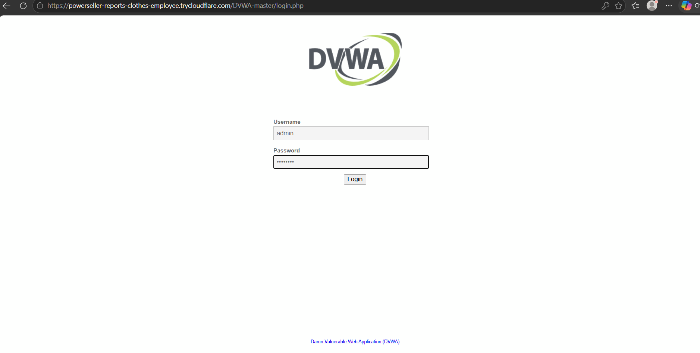
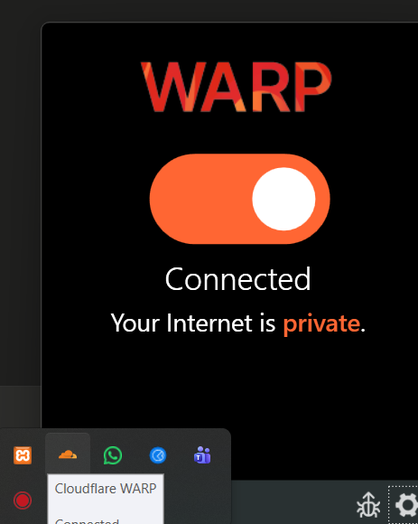
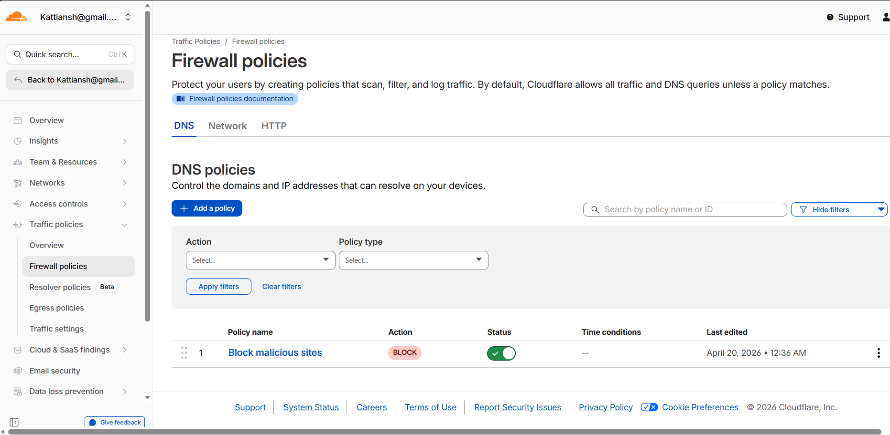
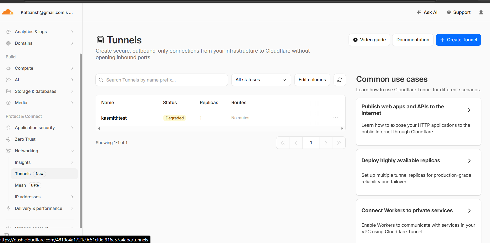
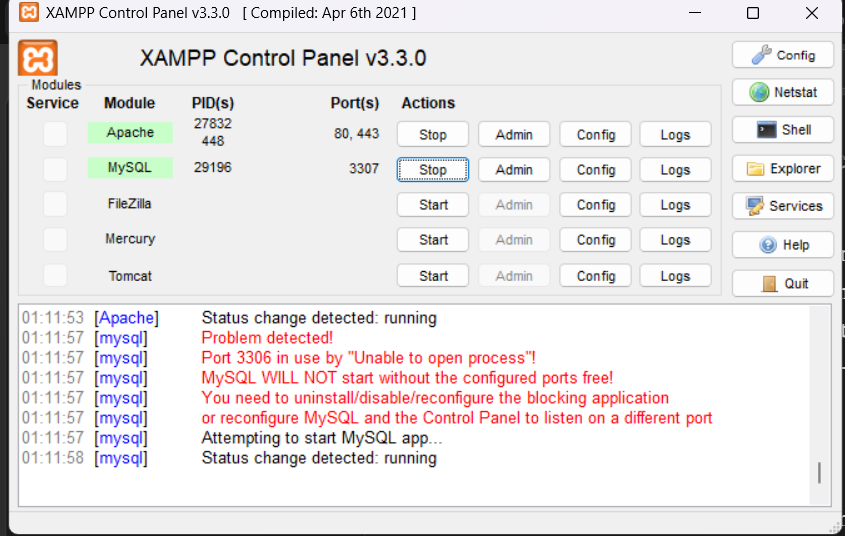
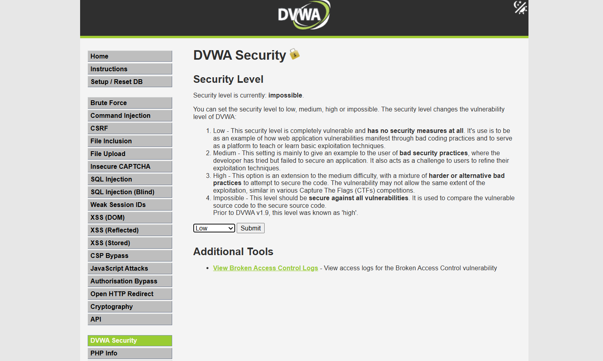
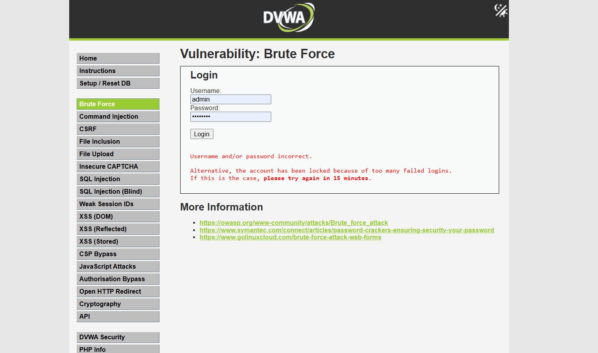

# sase-cloudflare-dvwa-project
Securing a Vulnerable Web Application using Cloud-Native SASE Architecture
🔐 Securing a Vulnerable Web Application using Cloud-Native SASE Architecture
> A proof-of-concept implementation using Cloudflare One, DVWA, and Zero Trust principles


---
📌 Project Overview
This project demonstrates how a SASE (Secure Access Service Edge) architecture can be implemented to secure access to a vulnerable web application. Using Cloudflare One as the SASE platform, the project simulates a real-world enterprise security setup where applications are protected without exposing any open ports or public IP addresses.
SASE is a modern cloud-native security framework used by enterprises like Google, Microsoft, and Infosys to replace traditional VPNs and perimeter-based security models.
---
🎯 Objectives
Implement core SASE components using free and open-source tools
Secure a deliberately vulnerable web application (DVWA) using Cloudflare Tunnel
Demonstrate Zero Trust principles through encrypted endpoint traffic via Cloudflare WARP
Implement Secure Web Gateway (SWG) using Cloudflare Gateway DNS policies
Demonstrate a real-world brute force attack and show how security levels mitigate it
Show how modern enterprises replace traditional VPNs with cloud-native security
---
🏗️ Architecture
```
  [ Your Device ]                    [ Cloudflare Network ]               [ DVWA App ]
  WARP Installed   ───encrypted───►  Global Edge / Tunnel  ───secure───►  localhost:80
       ↑                                     ↑                                 ↑
  Endpoint Security              SWG + FWaaS + Routing              XAMPP (Apache + MySQL)
```
Traffic Flow:
User accesses the public tunnel URL
Request hits Cloudflare's global network first
Cloudflare applies DNS policies and firewall rules (SWG)
Request is passed through the secure tunnel to the local DVWA app
Response travels back through the same secure path
At no point is the server's IP address or any port exposed to the internet
---
🧩 SASE Components Implemented
SASE Component	Full Name	Tool Used	Status
Tunnel / SD-WAN	Software Defined WAN	Cloudflare Tunnel	✅ Implemented
ZTNA	Zero Trust Network Access	Cloudflare WARP	✅ Implemented
SWG	Secure Web Gateway	Cloudflare Gateway DNS Policy	✅ Implemented
FWaaS	Firewall as a Service	Cloudflare Network (no open ports)	✅ Implemented
Vulnerable App	Security Test Target	DVWA	✅ Implemented
---
🛠️ Tools & Technologies
Tool	Version	Purpose
Cloudflare Tunnel (cloudflared)	2026.3.0	Secure tunnel — exposes local app without open ports
Cloudflare WARP	Latest	Endpoint security — encrypts all device traffic
Cloudflare Gateway	Free tier	DNS policies — blocks malicious websites
DVWA	Latest (master)	Deliberately Vulnerable Web Application
XAMPP	v3.3.0	Local web server (Apache + MySQL)
Windows	10/11	Host operating system
---
📋 Implementation Steps
Step 1 — Set Up Local Web Server (XAMPP + DVWA)
Installed XAMPP v3.3.0 on Windows
Started Apache (port 80) and MySQL (port 3307)
Downloaded DVWA from GitHub
Placed DVWA inside `C:\xampp\htdocs\DVWA-master`
Configured `config.inc.php` with database credentials
Initialized DVWA database via `setup.php`
Verified DVWA accessible at `http://localhost/DVWA-master`
Step 2 — Create Cloudflare Tunnel
Created Cloudflare account
Installed `cloudflared` on Windows using winget
Created named tunnel "kasmithtest" in Cloudflare dashboard
Ran quick tunnel connecting to `http://localhost/DVWA-master`
Received public HTTPS URL via trycloudflare.com
Verified DVWA accessible through tunnel URL
Step 3 — Install Cloudflare WARP (ZTNA Endpoint)
Downloaded and installed Cloudflare WARP client
Connected device to Cloudflare's global network
Verified status: "Your Internet is private" ✅
All device traffic now encrypted through Cloudflare
Step 4 — Configure Secure Web Gateway
Navigated to Cloudflare Zero Trust dashboard
Created DNS policy: "Block malicious sites"
Action: BLOCK
Status: Active ✅
Added default DNS location for policy enforcement
Step 5 — Security Testing with DVWA
Set DVWA security level to Low (no protection)
Demonstrated brute force attack — multiple failed logins
Account lockout triggered after repeated attempts
Set security level to High — attack mitigated
Documented attack vs defense comparison
---
📸 Screenshots
1. DVWA Login via Cloudflare Tunnel URL

> DVWA accessible through secure Cloudflare tunnel URL (HTTPS) — no direct server access
2. Cloudflare WARP — Endpoint Security

> WARP showing "Connected — Your Internet is private" — all traffic encrypted
3. Cloudflare Gateway — DNS Policy (SWG)

> "Block malicious sites" policy active — Secure Web Gateway implemented
4. Cloudflare Tunnel Dashboard

> Named tunnel "kasmithtest" created in Cloudflare dashboard
5. XAMPP Control Panel

> Apache and MySQL running — local web server powering DVWA
6. DVWA Security Levels

> DVWA security level configuration — Low to Impossible settings
7. Brute Force Attack Demo

> Brute force attack demonstration — account lockout triggered after failed attempts
---
🔬 Security Testing — Brute Force Demo
Attack Scenario (Security Level: Low)
Target: DVWA Brute Force module
Method: Multiple failed login attempts with wrong credentials
Result: "Username and/or password incorrect" — attack possible
Defense Scenario (Security Level: High)
Same attack attempted
Result: "Account locked — please try again in 15 minutes"
Defense: Account lockout policy triggered ✅
What This Demonstrates
Level	Protection	Real-World Equivalent
Low	None	Unprotected legacy system
Medium	Basic	Partially hardened system
High	Strong	Enterprise-hardened system
Impossible	Maximum	Zero Trust + MFA
---
💡 Key Learnings
Traditional security is outdated — opening firewall ports exposes servers to attacks. Cloudflare Tunnel eliminates this entirely.
Zero Trust means verify everyone — WARP ensures all traffic is encrypted and routed through Cloudflare before reaching any resource.
SWG blocks threats before they reach users — DNS-level blocking stops malicious domains before a connection is even established.
DVWA shows real attack patterns — brute force, SQL injection, XSS are real threats that SASE architecture helps mitigate.
Cloud-native security scales — the same Cloudflare infrastructure protecting this project protects Fortune 500 companies.
---
🚀 Future Improvements
[ ] Implement Zero Trust Access (requires Cloudflare paid plan)
[ ] Add CASB for cloud application security
[ ] Set up proper named tunnel with custom domain
[ ] Demonstrate SQL injection attack and mitigation
[ ] Integrate with identity provider (Google/GitHub SSO)
[ ] Add network traffic monitoring dashboard
---
📚 References
Cloudflare One Documentation
DVWA GitHub Repository
What is SASE? — Cloudflare
Zero Trust Security Model
OWASP Brute Force Attack
---
👩‍💻 Author
Anusha Kattimani
Project Type: Network Security / Cloud Security
Domain: SASE Architecture, Zero Trust, Cloud-Native Security
Tools: Cloudflare One, DVWA, XAMPP, Windows
---
⚠️ Disclaimer
This project is for educational purposes only. DVWA is a deliberately vulnerable application designed for security training. Never deploy DVWA in a production environment or expose it without proper security controls.
---
Built as a learning project to understand modern cloud-native SASE architecture and Zero Trust security principles.
